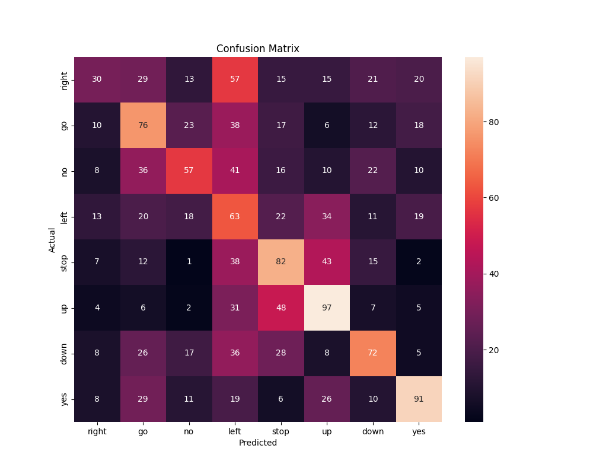

# Distance-Based Speech Recognition

This project implements a simple **distance-based speech recognition system** in Python.
The system classifies short speech commands by comparing FFT-based spectral features with class templates.



## Dataset

The project uses the **Mini Speech Commands** dataset:
[http://storage.googleapis.com/download.tensorflow.org/data/mini_speech_commands.zip](http://storage.googleapis.com/download.tensorflow.org/data/mini_speech_commands.zip)

## Overview

The system follows these main steps:

### 1. Frame the Audio Signal

The audio waveform is divided into fixed-length overlapping frames to capture local time-domain information.

### 2. Compute Spectral Features (FFT)

Each frame is transformed into the frequency domain using the **Fast Fourier Transform (FFT)**.
These spectral magnitudes represent the main features used for classification.

### 3. Build Class Templates (Training Phase)

For each speech class:

* FFT features of all training audio files are calculated.
* Frames are padded to equalize feature dimensions.
* A **template** is computed as the average FFT feature matrix of the class.

### 4. Extract Test Features

For every test audio file:

* Frames are created.
* FFT features are computed using the same parameters.

### 5. Classify Using Distance

The test features are compared with each class template using a chosen distance metric:

* Euclidean
* Cosine
* Correlation

The class with the smallest distance is selected as the prediction.

### 6. Compute Accuracy

Predicted labels are compared with true labels to calculate:

* Overall system accuracy
* Per-class accuracy
* Confusion matrix for detailed performance evaluation

## Features of This Implementation

* Distance-based template matching
* FFT spectral feature extraction
* Automatic framing and padding
* Train/test split
* Confusion matrix visualization
* Configurable distance metric
* Works directly on raw `.wav` files
* No neural networks required

## Project Folder Structure

```
project/
│── data/
│   └── mini_speech_commands/
│── main.py
│── README.md
│── figure.png
```

## Requirements

Install dependencies:

## Running the Project

Run the script:

```bash
python main.py
```

This will:

* Compute class templates
* Test on unseen samples
* Display accuracy
* Show the confusion matrix

---
